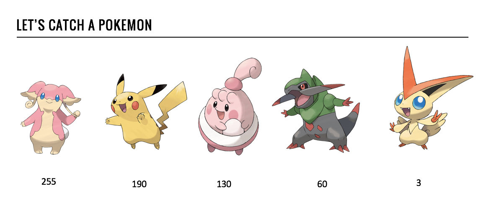
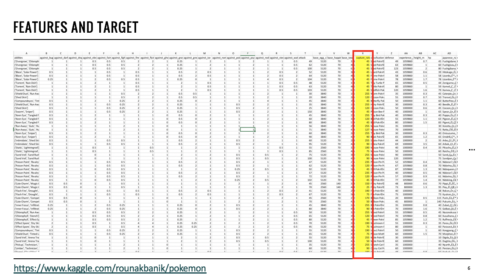
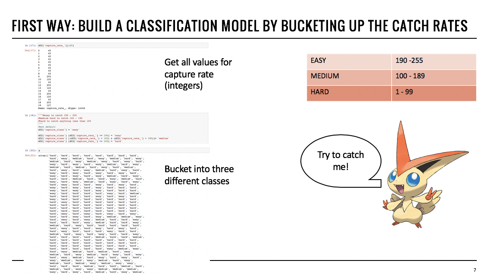
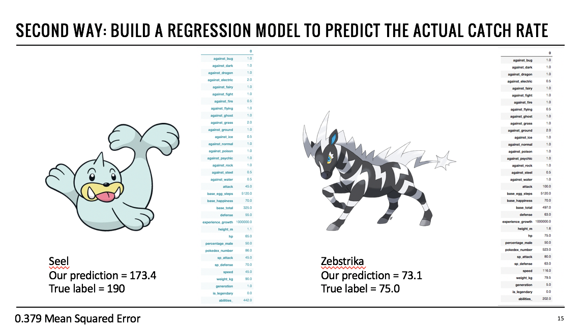

# predict_pokemon
This notebook comes from a short basic ML 101 presentation about 2 years ago on a fun pokemon dataset. It explores two models - a Random Forest Classifier for a classification model, and a Multi-Layer Perceptron (Feed-Forward Network) for a regression model, to predict a pokemon's capture rate. 

You need to download the pokemon dataset from Kaggle first: https://www.kaggle.com/rounakbanik/pokemon. 

Each pokemon has a `capture_rate`. We'll predict the capture_rate by building a multi-class classifier using a Random Forest Classifier and exploring the feature importance...

Then another approach, by building a MLP as a regressor to predict the actual capture rate value. 

